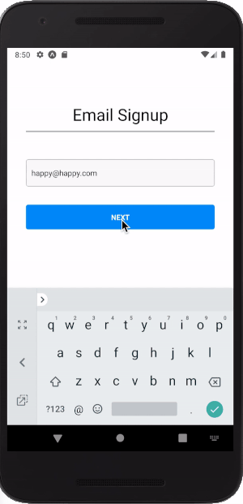
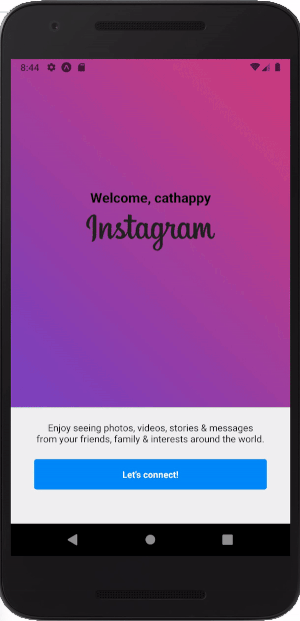
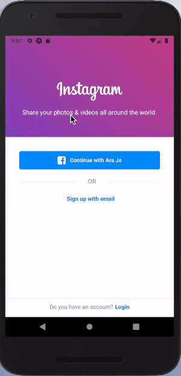
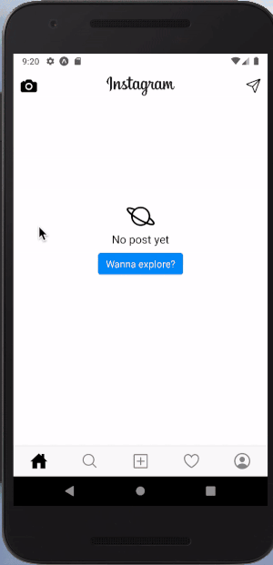
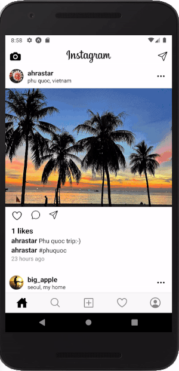

# Instagram Mobile App Clone

This is Instagram mobile app clone in Android (recommend), and iOS with Expo.

1. Fork this repository
2. `$ cd insta-clone_native`
3. `npm run android`  or  `npm run ios`  (You need to install each emulator already)

## Functions

- splash for the better user experience

  

- sign up with email

  

  

- log in page + confirm email page (to prevent user from using an invaild email)

  

- facebook login

  

  

- explore random user posts and follow the user

  

- send message and invite friends

  

  

- take and select a picture in user album and upload it

  

  

## Feedback

### Development

Want to contribute? Great!

To fix a bug or enhance an existing module, follow these steps:

- Fork the repo
- Create a new branch (`git checkout -b improve-feature`)
- Make the appropriate changes in the files
- Add changes to reflect the changes made
- Commit your changes (`git commit -am 'Improve feature'`)
- Push to the branch (`git push origin improve-feature`)
- Create a Pull Request

### Bug / Feature Request

If you find a bug (the API couldn't handle the query and / or gave undesired results), kindly open an issue [here](https://github.com/iknowahra/insta_clone_native/issues/new) by including your search query and the expected result.

If you'd like to request a new function, feel free to do so by opening an issue [here](https://github.com/iknowahra/insta_clone_native/issues/new). Please include sample queries and their corresponding results.

